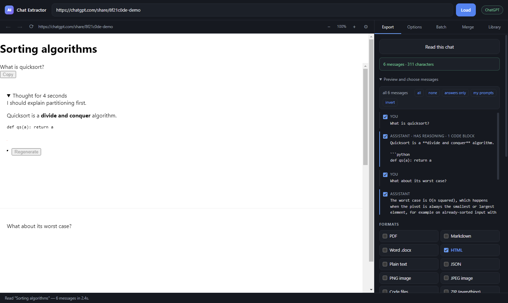

<div align="center">


# AI Chat Extractor

**Export any AI conversation to PDF, Word, Markdown, HTML, JSON, images — or a folder of runnable source files.**

Works with ChatGPT, Claude, Gemini, DeepSeek, Grok, Copilot, Perplexity, Poe, Qwen,
Le Chat, Kimi, GapGPT — and, via a learn-by-clicking fallback, more or less anything else.

[](https://github.com/amirtavakolihaghighi/ai-chat-exporter/actions/workflows/ci.yml)
[](CHANGELOG.md)
[](LICENSE)

[Manual](docs/MANUAL.md) · [Troubleshooting](docs/TROUBLESHOOTING.md) · [Architecture](docs/ARCHITECTURE.md) · [Testing](docs/TESTING.md) · [Publishing](docs/PUBLISHING.md) · [Changelog](CHANGELOG.md)

</div>



---

Everything runs locally. No account, no server, no telemetry. Neither product
makes a network request of its own — the only fetches are for images inside the
chat you are exporting.

## Two ways to use it

| | **Browser extension** | **Desktop app** |
| --- | --- | --- |
| | Chrome · Edge · Firefox | Windows |
| Getting a chat in | You are already on the page | Paste a share link, or sign in inside the app |
| Private chats | Immediate — your own session | Sign in inside the app once |
| Output location | Downloads only | Any folder |
| PDF | Print dialog | Automatic, with page numbers |
| Full-page images | Stitched, slower | One operation |
| Best for | Everyday exporting | Bulk PDFs, images, a chosen folder |

They share the same extraction engine and the same document builders, and each
can merge the other's JSON exports.

## Quick start

```bash
git clone https://github.com/amirtavakolihaghighi/ai-chat-exporter.git
cd ai-chat-exporter
npm install
npm run icon          # once — generates the icons
```

**Extension**

```bash
npm run ext:build
```

- **Chrome / Edge** — `chrome://extensions` → Developer mode → **Load unpacked** → `extension/dist/chrome`
- **Firefox** — `about:debugging#/runtime/this-firefox` → **Load Temporary Add-on** → `extension/dist/firefox/manifest.json`

Open a chat, click the toolbar button, **Read this chat**.

**Desktop app**

```bash
npm start             # run it
npm run dist          # build installer + portable .exe into dist/
```

## What it does

- **Reads the whole conversation**, including the parts not on screen. Long chats
  are *virtualised* — sites delete off-screen messages — so the reader scrolls
  and harvests continuously when it has to, then checks its own coverage and
  re-reads anything it might have missed.
- **Choose the messages** you want with tick boxes and presets (answers only, your
  prompts, invert).
- **Ten formats**, including `.docx` that is real OOXML and code files extracted as
  runnable sources.
- **Keeps your images**, because share links hand out URLs that expire.
- **Searches everything you have exported**, full text.
- **Merges several chats** into one document with a table of contents.
- **Redacts** before writing, with literal or regex rules.
- **Right-to-left** Persian, Arabic and Hebrew in HTML, PDF and Word.
- **Learns sites it does not know**: click one message and it works out a selector
  for the rest, saved for next time.

See the [manual](docs/MANUAL.md) for how each of these works.

## Provider support

Selectors are a best-effort starting point, not a contract — these sites change
their markup regularly. Verified means a real conversation has been exported and
checked end to end.

| Provider | Status |
| --- | --- |
| GapGPT | Verified — dedicated pack, including its one-element-per-exchange layout |
| ChatGPT, Claude, Gemini, DeepSeek, Grok, Copilot, Perplexity, Poe, Qwen, Le Chat, Kimi | Packs written, not all individually verified |
| LibreChat, Open WebUI and other re-skins | Generic pack |
| Anything else | Structural heuristic, plus the picker |

If a site reads wrongly, [`docs/site-report.js`](docs/site-report.js) describes
its structure so a pack can be written for it — see
[Troubleshooting](docs/TROUBLESHOOTING.md).

## When a site is not recognised

Provider markup changes constantly, so nothing is trusted on its own. The reader
degrades in stages:

1. **A provider pack** — known selectors for a known site.
2. **A structural heuristic** — pick the container whose children look like a
   message list. This handles unknown sites and re-skinned front-ends.
3. **Pick a message by hand** — click one message; a selector for all of them is
   derived and saved for that site, overriding the built-ins. This is how you
   repair a provider redesign yourself in ten seconds instead of waiting for an
   update. Your rules are listed under **Options → Saved site rules**.
4. **Capture as shown** — a screenshot needs no parsing at all.

## Development

```bash
npm test               # conversion core — plain Node, fast
npm run test:electron  # the real extractor against DOM fixtures, plus capture
npm run test:e2e       # boots the real app and drives the real UI to files
npm run test:extension # manifests, built bundles, browser-side exports
npm run bench          # reading speed and completeness
```

Architecture and the reasoning behind the awkward parts:
[docs/ARCHITECTURE.md](docs/ARCHITECTURE.md). Contributions:
[CONTRIBUTING.md](CONTRIBUTING.md).

Automated tests cannot cover the thing most likely to break — extraction from
real, frequently-redesigned provider sites. [docs/TESTING.md](docs/TESTING.md) is
a hand-testing checklist for exactly that.

## Repository layout

```text
src/                  desktop app + the shared core
  shared/             provider packs, text direction, byte helpers
  inject/             scripts that run inside the chat page
  main/               Electron main process, converters, exporters
  renderer/           desktop UI
extension/            browser extension (imports the same core)
scripts/              build helpers
docs/                 manual, testing, architecture, troubleshooting
test/                 suites, fixtures, benchmark
```

## Known limitations

- **The chat tab must stay in front while reading.** Browsers throttle background
  tabs so hard that chat sites stop redrawing, so the extension brings the tab
  forward and returns you afterwards.
- **Extensions cannot choose an output folder.** Browser policy; everything goes to
  `Downloads/AI Chat Exports/`.
- **PDF from the extension goes through the print dialog.** Quality is identical —
  same print engine — but it is not automatic and there is no page-number footer.
- **"As shown" capture of a long chat may be partial**, since it can only include
  what the site currently has in the page. Clean mode has no such limit.
- **Nothing is code-signed.** SmartScreen will warn on first run.

## Licence

[MIT](LICENSE).

Not affiliated with OpenAI, Anthropic, Google, or any other provider. Please
respect the terms of service of the sites you export from, and other people's
privacy when sharing a conversation.
